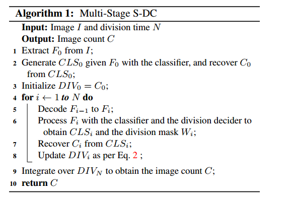

# Crowd_Density_Estimation


# Input 


# Output 


# Objective 

Predicting the number of people present(count) in the selected region(Region Of Interest)

# Apporach

To solve this problem statement I am implementing the S-DCNet(https://arxiv.org/pdf/1908.06473v1.pdf) research paper work.

## Introduction : 

S-DCNet : Spatial Divide-and-Conquer Network 

Counting is an open-set problem by nature as a count value can range from 0 to +∞ in theory.It is thus typically modeled in a regression manner(open set problem).

counting has an unique property—spatially decomposable.spatial divide-and-conquer (S-DC). Suppose that a network has been trained to accurately predict a closed set of 
counts, say 0 ∼ 20. When facing an image with extremely dense objects, one can keep dividing the image into sub-images until all sub-region counts are less
than 20. Then the network can accurately count these subimages and sum over all local counts to obtain the global
image count.


A naive way is to upsample the input image, divide it into sub-images and process sub-images with the same network.
This way, however, is likely to blur the image and lead to exponentially-increased computation cost and memory consumption when repeatably extracting the feature map.
Inspired by RoI pooling , we show that it is feasible to achieve S-DC on the feature map, as conceptually illustrated in the below image. By decoding and upsampling the feature map, the later prediction layers can focus on the feature of local areas and predict sub-region counts accordingly.


Note : SDCNet learns from a closed set of count values but is able to generalize to open-set scenarios

S-DCNet adopts a VGG16 based encoder and an UNet like decoder to generate multi-resolution feature maps.

## S-DCNet Model Proposal 

In contrast to the conventional density map regression, S-DCNet discretize continuous count values into a set of intervals and design the counting predictor to be a classifier. 
Further, a division decider is designed to decide which sub-region should be divided and to merge different levels of sub-region counts into the global image count.

Note : Even given a closed training set, S-DCNet effectively generalizes to the open test set.

### From quantity to interval transformation 

we define an interval partition of [0, +∞) as {0}, (0, C1], (C2, C3], ... , (CM − 1 , CM] and (CM, +∞).
These M + 1 sub-intervals are labeled to the 0-th to the Mth classes, respectively. For example, if a count value iswithin (C2, C3], it is labeled as the 2-th class.
In practice, CM should be not greater than the max local count observed in the training set.

The median of each sub-interval is adopted when recovering the count from the interval. 


# The architecture of S-DCNet (left) and a two-stage S-DC process (right)




Where 
F0 = Feature map
CLS0 = Class label of count interval
C0 = Total count value 
DIV0 = Division count

DIV1 = (1 − W1) ◦ avg(C0) + W1 ◦ C1 (single stage) 
DIVi = (1 − Wi ) ◦ av g ( D I Vi − 1) + Wi ◦ Ci (multi stage)(i>=2)


# Implementation Details 

### Interval Partition : 

One-Linear Partition : {0}, (0.0.5],(0.5, 1], ...,(Cmax − 0.5,Cmax] and (Cmax, +∞), where Cmax denotes the maximum count of the closed set.

Two-Linear Partition : In the second partition, we further finely divide the subinterval (0.0.5], because this interval contains a sudden change from no object to part of an object, and a large proportion of objects lie in this sub-interval. A small step of 0.05 is used to divide this interval. We call this partition.

### Training 

S-DCNet is implemented with PyTorch. We train S-DCNet using standard SGD.
The encoder in S-DCNet is directly adopted from convolutional layers of VGG16 pretrained on ImageNet, and the other layers employ random Gaussian initialization with
a standard deviation of 0 .01. The learning rate is initially set to 0 .001 and is decreased by × 10 when the training error stagnates.

batch size =1
Metrics = MAE & RMSE 
Loss function 


Lc : cross entropy (classification)
LR : final division loss 


We conduct a statistical analysis on count values of local patches in the training set, and then set Cmax with the quantiles ranging from 100% to 80% (decreased by 5%).
Twostage S-DCNet is evaluated.The maximum count of the training set seems not the best choice, while some small quantiles even deliver better performance. Perhaps a 
model is only able to count objects accurately within a certain degree of denseness. We also notice Two-Linear Partition is slightly better than
One-Linear Partition, which indicates that the fine division to the (0, 0.5] sub-interval has a positive effect.


# Model Performance on state-of-art-datasets 

The influence of Cmax to S-DCNet on the ShanghaiTechn Part A dataset [38]. The numbers in the brackets denote quantiles of the training set, for example, 22 (95%) means the 95% quantile is 22. ‘VGG16 Encoder’ is the classification baseline without S-DC. ‘One-Linear’ and ‘Two-Linear


Conclusion : It justifies our argument that,instead of regressing a large count value directly, it is more accurate to count dense patches through S-DC.


# How To Run This Repo

## Requirements 

```bash
pip install opencv-python
```

```bash
pip install termcolor
```

```bash
conda install pytorch torchvision torchaudio cudatoolkit=10.2 -c pytorch
```


## Folder structure


## Flow 

Basically SDCNet model train on 5 state-of-art data sets using GPU and model weights are saved.
I don't have GPU in my system & train the model in colab also not possible that's why I download the pretrained model weights of S-DCNet of ShanghaiTech A & B 
For pretrained wieghts follow the link(https://drive.google.com/file/d/1MIOoPWsoXnoXcPdjWxvFl5n8gM7DBqU8/view?usp=sharing)

# Command to run the prototype model

Before run the prototype install required lib

Step 1 : python prototype.py --video [video path] --cap=0 --SDCNet [pretrained weights path]

ex: python prototype.py --video \Users\vksva\Desktop\CDE\123.mp4 --cap=0 --SDCNet \Users\vksva\Desktop\CDE\Crowd-DCNet-master\model\SHA\best_epoch.pth

Step2 :After running command wait for some time pretrained weights will be added. 

Step3 : After the weights added one frame window will open on the desktop.

Step4 : After frame window opend you need to select the Region Of Interest(RoI) using + mark.

Step5 : After selecting the region using + mark you need to press the SPACE or ENTER to confiorm the selected region.

Step6 : After selcting region you need to press ESC button to find count( this process take some time to calculate count wait for it ) 

Step7 : If you want to unselect the selected region then press c button 

Step8 : To close the opened frame window press q button

Note : I am using using CPU for tensor processing If you have GPU then change device in prototype.py


